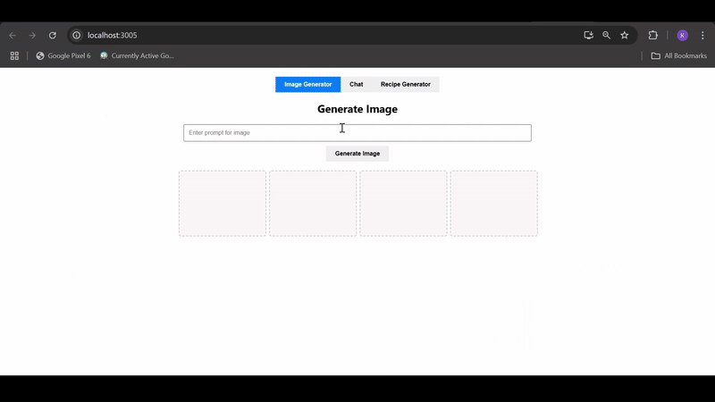

```
# 🌿 Spring AI Chat Image Recipe Frontend

This is the **frontend application** for a full-stack AI-powered platform that allows users to:
- 💬 Chat with an AI assistant
- 🎨 Generate images from text prompts
- 🍲 Generate recipes based on ingredients, cuisine, and dietary preferences

Built using **ReactJS**, this interface connects to a Spring Boot backend that leverages **Spring AI** for natural language and image processing.

---

## 🚀 Features

- **AI Chat Interface** – Ask any question and receive a real-time typed response.
- **Image Generator** – Enter a prompt and get an AI-generated image.
- **Recipe Generator** – Input ingredients, cuisine, and dietary restrictions to get a full recipe.
- **Loading Indicators** – Elegant animated dots mimic ChatGPT-style typing/loading behavior.
- **Responsive Design** – Clean, user-friendly layout for both desktop and mobile.

---

## 🛠️ Tech Stack

- ⚛️ React 18
- 🎨 CSS (Custom styling)
- 🌐 Fetch API (for backend communication)
- 🧠 Backend: Spring Boot (Spring AI, OpenAI integration)

---

## 📁 Project Structure

```

spring-ai-chat-image-recipe-frontend/
│
├── public/
│   └── index.html
├── src/
│   ├── components/
│   │   ├── Chat.js
│   │   ├── ImageGenerator.js
│   │   └── RecipeGenerator.js
│   ├── App.css
│   └── App.js
├── package.json
└── README.md

````

---

## 🧪 Running Locally

> Make sure the backend is running on `http://localhost:3000`.

### 1. Clone the repository:

```bash
git clone https://github.com/yourusername/spring-ai-chat-image-recipe-frontend.git
cd spring-ai-chat-image-recipe-frontend
````

### 2. Install dependencies:

```bash
npm install
```

### 3. Run the frontend server:

```bash
npm start
```

The app should open at `http://localhost:5173` (or whatever your React dev server uses).

---

## 🌐 API Endpoints (Expected from Backend)

* `GET /ask-ai?prompt=...`
* `GET /generate-image?prompt=...`
* `GET /recipe-creator?ingredients=...&dietaryRestrictions=...&cuisine=...`

> These endpoints should be handled by your [Spring Boot backend](https://github.com/yourusername/spring-ai-chat-image-recipe-backend).

---

## 📽️ Demo



> 🔁 This GIF showcases the full functionality of the application including the Chat UI, Image Generator, and Recipe Generator in action.

---

## 📄 License

This project is licensed under the [MIT License](LICENSE).

---

## 🤝 Contributions

Pull requests, feature suggestions, and bug reports are welcome!
Feel free to fork and improve the project.

---

## ✨ Credits

Built with ❤️ using React and Spring Boot
Powered by [Spring AI](https://docs.spring.io/spring-ai/) and OpenAI APIs


```
